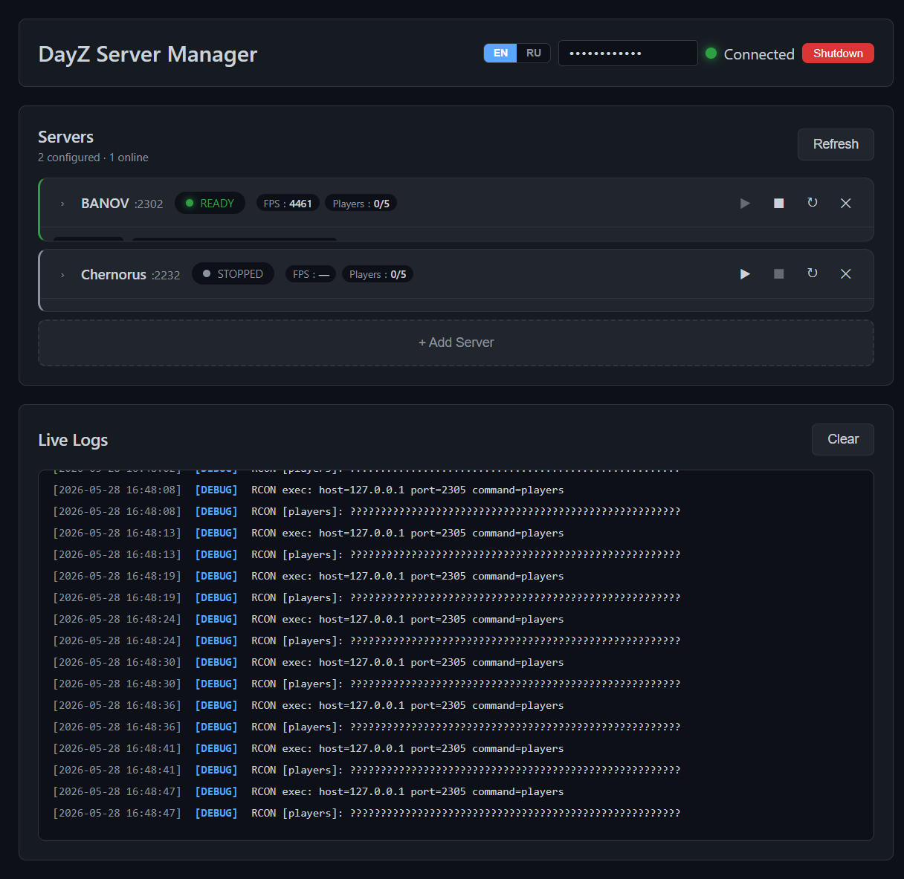
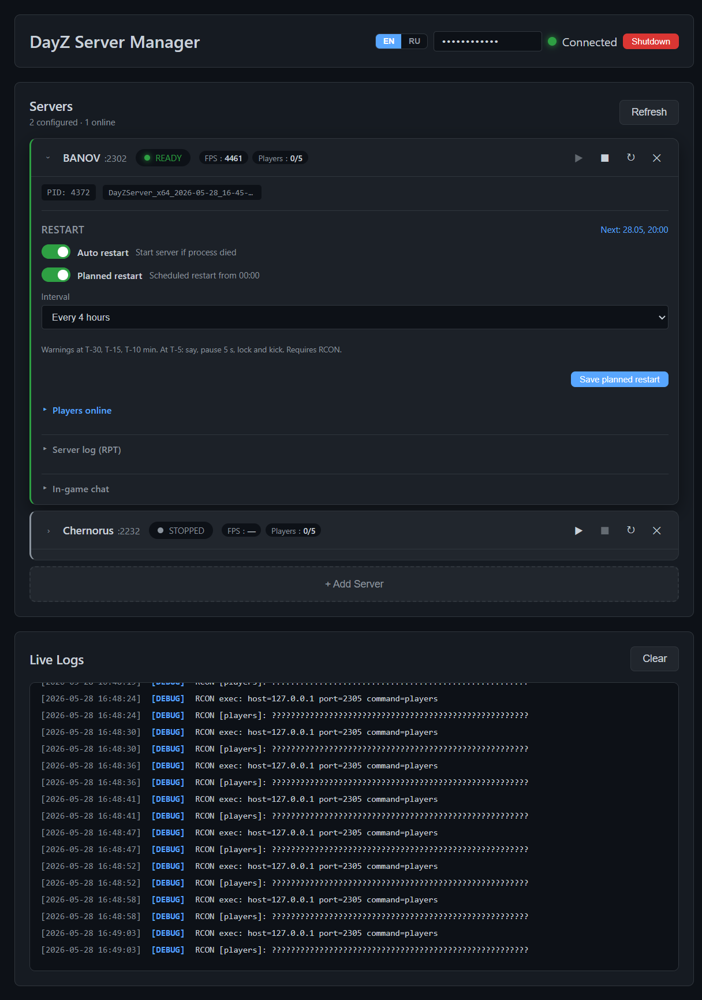

# DayZ Server Manager

Единый менеджер DayZ-серверов на Windows: веб-UI, REST API, WatchDog, автообновление модов через SteamCMD, плановые и CRON-рестарты. **Любая карта и набор модов** — только через `config.json` (путь сервера, `mod_list.txt`, launch args). Несколько инстансов на одном хосте.

Текущая роль проекта: **локальный менеджер на игровом хосте**. В будущем этот код может стать **host-agent** за отдельным cloud/admin-контуром, но сейчас репозиторий **не** предоставляет публичную интернет-панель.

**Languages:** [English](README.md) · [Русский](README.ru.md)

**Документация:** [docs/ru/INDEX.md](docs/ru/INDEX.md) · **Лицензия:** [MIT](LICENSE) · **Скачать:** [Releases](https://github.com/devmrbouh-hub/dayz_manager/releases) (готовый EXE)

> **Описание репозитория на GitHub:** `Менеджер DayZ dedicated server для Windows — веб-UI, несколько серверов, моды SteamCMD, RCON, WatchDog, плановые рестарты`

## Требования

Перед быстрым стартом: установлены **DayZ Dedicated Server** и **SteamCMD**, BattlEye RCON настроен на сервере.

Поле `servers[].id` — любое имя (`server1`, `chernarus`, …). В примерах документации используется `server1`; подставьте свой id из `config.json`.

**Не стартует?** Проверьте `auth.api_key`, пути Steam и [RUNBOOK.md](docs/ru/RUNBOOK.md).

- Windows, Python 3.10+
- [SteamCMD](https://developer.valvesoftware.com/wiki/SteamCMD) и установка DayZ Server
- **bercon-cli.exe** — в корне проекта или путь в `rcon.client_path` в `config.json` (см. [CONFIG.md](docs/ru/CONFIG.md))

## Возможности

- Несколько серверов: start / stop / restart
- WatchDog — автоперезапуск при падении (`auto_restart`, интервал `settings.watchdog_interval`, по умолчанию 10 с)
- **Planned restart** — рестарт по интервалу от 00:00 с RU/EN предупреждениями, lock и kick на T-5 (настройка на карточке сервера)
- Проверка и синхронизация модов (`mod_list.txt`, junction, Steam Web API)
- CRON-рестарты (legacy) по `scheduler.restart_schedule`
- RCON: say, lock, kick, graceful shutdown
- Web UI, REST API, WebSocket логов
- **Live stats** на карточке: FPS, игроки X/max, список ников
- **Игровой чат** на карточке: ExpLog + admin say (24 ч история)
- Хуки `beforeStart` / `afterStop`
- Сборка в один EXE (`build.bat`)

## Скриншоты

Компактный список серверов — несколько инстансов на одном хосте:



Развёрнутая карточка — рестарт, RPT-лог, игровой чат:



## Модель доступа

- Проект рассчитан на **доверенный локальный хост** или приватную админ-сеть.
- Базовый сценарий: открыть `http://127.0.0.1:8000` на той же машине и ввести `auth.api_key`.
- Встроенный UI/API не стоит рассматривать как публичную панель для интернета. Для удалённого доступа нужен отдельный gateway/cloud-слой перед будущим agent.
- Hooks выполняют локальный Python-код из директории установки и должны считаться доверенной админ-автоматизацией.

## Быстрый старт

### 1. Клонировать и зависимости

```powershell
git clone https://github.com/devmrbouh-hub/dayz_manager.git
cd dayz_manager
python -m venv .venv
.\.venv\Scripts\Activate.ps1
pip install -r requirements.txt
```

### 2. RCON-клиент

Скачайте [bercon-cli](https://github.com/WoozyMasta/bercon-cli) и положите `bercon-cli.exe` в корень проекта  
или укажите путь в `config.json` → `rcon.client_path` (см. шаблон).

### 3. Конфиг

```powershell
copy config\config-host-template.json config\config.json
```

В `config\config.json` обязательно задайте:

| Поле | Что указать |
|------|-------------|
| `auth.api_key` | Свой ключ (не `change_this_api_key` — иначе менеджер не стартует) |
| `steam.steamcmd_path`, `steam.workshop_path` | Пути к SteamCMD и Workshop |
| `servers[].path`, порты | Папка и порты вашего dedicated server |
| `servers[].rcon_password` | Как в BattlEye `BEServer_*.cfg` |

Пароль Steam — через `DAYZ_STEAM_USERNAME` / `DAYZ_STEAM_PASSWORD` или поля `steam.*` (см. [CONFIG.md](docs/ru/CONFIG.md)).

`config/config.json` **не в git** — только на вашей машине.

### 4. Запуск

```powershell
python src/main.py
```

Откройте **http://127.0.0.1:8000** → введите тот же `auth.api_key` в поле API Key (сохранится в браузере для локального UI).

### 5. Проверка

```powershell
pytest
# или smoke (менеджер должен быть запущен):
set API_KEY=ваш_ключ_из_config
set SERVER_ID=server1
test_system.bat
```

Дальше: [RUNBOOK.md](docs/ru/RUNBOOK.md) (BattlEye, firewall), [DEPLOY.md](docs/ru/DEPLOY.md) (EXE на хост).

## Production (хост)

### Вариант A — скачать Release (без сборки)

1. **[Releases](https://github.com/devmrbouh-hub/dayz_manager/releases)** → архив **`dayz_manager-*-windows-x64.zip`**
2. Распаковать; `config\config-host-template.json` → `config\config.json`, отредактировать
3. Запустить `DayZManager.exe` → http://127.0.0.1:8000

Инструкция: [docs/ru/RELEASES.md](docs/ru/RELEASES.md)

### Вариант B — собрать из исходников

1. `build.bat` → `dist\DayZManager.exe` (нужен `bercon-cli.exe` в корне проекта)
2. Скопировать EXE на хост; **не перезаписывать** рабочий `config.json`
3. Шаблоны: `config/config-host-template.json`, `config/config-host-nru90-template.json`

Подробно: [docs/ru/DEPLOY.md](docs/ru/DEPLOY.md), чеклист: [docs/ru/RUNBOOK.md](docs/ru/RUNBOOK.md).

## Структура

```
dayz_manager/
├── src/           # Python: core, api, notifications
├── web/           # UI
├── config/        # config.json (локально, в .gitignore)
├── hooks/         # Кастомные хуки
├── scripts/       # опциональные helper-скрипты
├── docs/          # документация (EN); docs/ru/ — русский
├── build.bat
└── README.md
```

## Ветка и релизы

Актуальная ветка: **`main`**. Фазы стабилизации и admin UI (planned restart, live stats, чат) влиты — см. [CHANGELOG.md](docs/ru/CHANGELOG.md) и [ROADMAP.md](docs/ru/ROADMAP.md).

Планы масштабирования (интернет, карта, магазин, SaaS): [docs/ru/PRODUCT_ARCHITECTURE.md](docs/ru/PRODUCT_ARCHITECTURE.md).

## Опциональные helper-скрипты

Не обязательны для первого запуска. Сервер: `DAYZ_MANAGER_SERVER` или первый в `config.json`.

```powershell
python scripts/test_stability_local.py
python scripts/start_server_direct.py   # sync + start без SteamCMD pre-download
```

См. [docs/ru/TESTING.md](docs/ru/TESTING.md).
