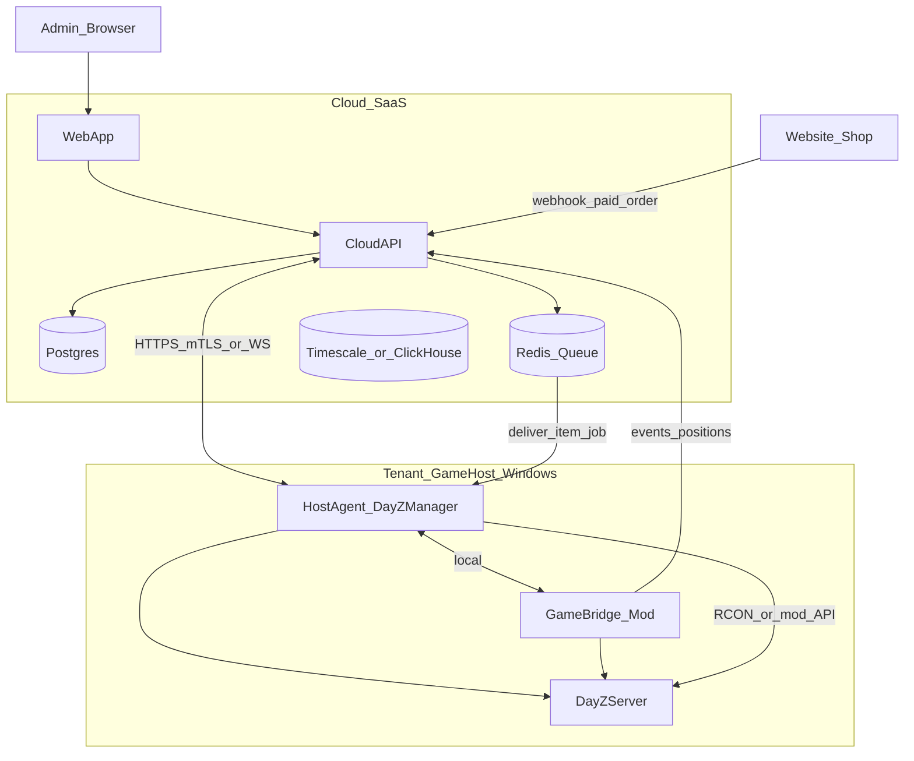

# Product architecture: scaling and SaaS

**Languages:** [English](PRODUCT_ARCHITECTURE.md) · [Русский](ru/PRODUCT_ARCHITECTURE.md)

Target architecture if DayZ Manager grows from a **host panel** to a **cloud product** with internet access, game features, and resale to other server owners.

**Current code** (`dayz_manager`) is the **Host Agent** layer (phase 1). Cloud and Game Bridge are separate systems, not extensions of one EXE.

Related docs:

- [HOW_IT_WORKS.md](HOW_IT_WORKS.md) — how the agent works today
- [ROADMAP.md](ROADMAP.md) — near-term host UI features (phase 2)
- Donations/shop (tenant business rules): outside this repository — implement in Cloud, not in EXE

---

## Product zones

| Zone | Examples | Where it lives |
|------|----------|----------------|
| **A. Host management** | Start/stop DayZ, mods, restarts, manager logs | **Host Agent** (current `dayz_manager`) |
| **B. Game logic** | Item delivery, map positions, online state | **Game Bridge** (mod / Expansion / COT / custom) |
| **C. Cloud** | Admin login, multi-server, map, stats, billing | **Cloud API + Web App** |
| **D. Integrations** | Payments, website, Discord | **Shop / Payment service** |

---

## Target topology (three tiers)

---

## Why not grow one EXE into “everything on the internet”

1. **Internet exposure** — do not publish `0.0.0.0:8000` with a single `X-API-Key`. Need HTTPS, OAuth/2FA, RBAC, rate limits, audit, tenant isolation.
2. **Live map and players** — RCON and logs are not enough. Need **Game Bridge** pushing coordinates and events.
3. **Shop and auto-delivery** — order queue, idempotency, delivery confirmation. Otherwise duplicate items and disputes.
4. **Selling to other owners** — multi-tenant SaaS: accounts, N servers, plans, billing. One on-disk `config.json` does not scale.

Keep the current stack (Python monolith + PyInstaller) for **Agent**; public admin and shop live in **Cloud**.

---

## Components

### 1. Host Agent (evolution of `dayz_manager`)

- Windows, next to dedicated server.
- Processes, mods, local RCON, **jobs from cloud** (deliver, kick, restart).
- Cloud link: **outbound** WebSocket or mTLS (agent connects — no inbound ports on customer host).
- Do not expose panel to the internet; do not store payment secrets in plain text.

### 2. Game Bridge (new layer)

Depends on mod pack:

- Expansion / Community Online Tools / VPP — partial features via their API/RCON.
- **Custom server mod** — full control (positions, vehicles, delivery callbacks).

Bridge accepts commands from Agent and pushes events: `player_position`, `vehicle_position`, `connect`/`disconnect`, `death`, etc.

### 3. Cloud (product core for resale)

| Component | Example stack | Purpose |
|-----------|---------------|---------|
| API | Go / .NET / FastAPI (separate service) | tenants, auth, jobs, billing |
| DB | PostgreSQL | users, servers, orders, roles |
| Queue | Redis / NATS | item delivery, retries |
| Stats | TimescaleDB / ClickHouse | kills, online, economy |
| Live map | Redis + WebSocket fanout | latest positions |
| Web | React/Next or Vue | admin + public stats |
| Files | S3-compatible | backups, export |

Public player site and admin can be one frontend with different roles.

### 4. Shop

Typical flow:

1. Player pays on website (Stripe, etc.).
2. Webhook → Cloud: `order_paid` (signature, idempotency key).
3. Cloud creates `delivery_job`: `server_id` + `steam_id` + `product_sku`.
4. Agent/Bridge on host executes delivery.
5. Callback `delivered` / `failed` → status on site.

Shop/donation business rules live in **Cloud**, not in EXE.

---

## Security (minimum for resale)

- Cloud **HTTPS only** (Let's Encrypt / Cloudflare).
- **Tenant isolation**: `owner_id` on all entities; agent token bound to tenant.
- **RBAC**: owner / admin / moderator / viewer; separate rights for delivery, map, billing.
- **2FA** for owners.
- Agent: **no inbound ports** from internet; rotate tokens.
- **Audit log**: who delivered item, who restarted server.
- Rate limits and shop webhook protection.

Current `X-API-Key` + `CORS *` are **not suitable** for public SaaS.

---

## Sales models

| Model | What is sold | Infra |
|-------|--------------|--------|
| **Self-hosted license** | Agent + Bridge + optional Cloud at customer | License, updates |
| **SaaS** | Subscription per server/slot | Your Cloud; customer runs Agent+Bridge only |
| **Hybrid** | SaaS panel + agent on customer hardware | Common for DayZ |

For SaaS: onboarding (token → agent → server in panel), health dashboard, agent/cloud API versions.

---

## Current stack assessment (brief)

**Good for Agent:** Python, FastAPI, asyncio scheduler, subprocess/psutil, static web, PyInstaller, modules (`server_mgr`, `mod_sync`, `scheduler`).

**Debt before scale:**

- Sync `prepare_server_for_start` / `start_server` in async routes block event loop — move to `run_in_executor`.
- PyInstaller may bundle extra modules — dedicated venv and strict `.spec`.
- No multi-tenant, no outbound Cloud channel.

**Full rewrite not required** — evolve Agent + new Cloud + Bridge.

---

## Practical roadmap

| Phase | Content |
|-------|---------|
| **1 (done)** | Stable Host Agent on host |
| **1.5** | Executor in API; Cloud outbound stub; remote jobs |
| **2** | Cloud MVP: auth, agent pairing, basic delivery via RCON/known mod |
| **3** | Map (Bridge + WebSocket), stats (logs → mod events) |
| **4** | Shop, billing, white-label |

`feature/admin-ui` in this repo is **local host panel**. Public admin is a separate frontend on Cloud API.

---

## Stack recommendations by layer

| Layer | Recommendation |
|-------|----------------|
| Host Agent | **Python** — keep |
| Game Bridge | Enforce / mod + local relay if needed |
| Cloud API | Go / .NET for load; **FastAPI** for fast MVP |
| Frontend | **React/Next** — map (Leaflet/Mapbox), dashboards, i18n |
| Realtime | WebSocket via **Cloud**, not agent exposed to internet |

---

## DayZ-specific risks

- Different mod packs per customer — **adapters** (`ExpansionAdapter`, `COTAdapter`, `VanillaRCONAdapter`) or official SaaS mod.
- Steam/Workshop — agent only; passwords not in cloud.
- Product sale: license, SLA, GDPR for EU players, Steam ID retention policy.

---

## Summary

**Current architecture is optimal for host management.** For internet, map, stats, shop, and resale you need **Cloud + Host Agent + Game Bridge**. A monolith EXE with UI on `:8000` on the public internet does not scale and is unsafe as the sole product surface.

---

*Document created: 2026-05-23. Context: scaling discussion after merge `feature/stability` → `master`.*
