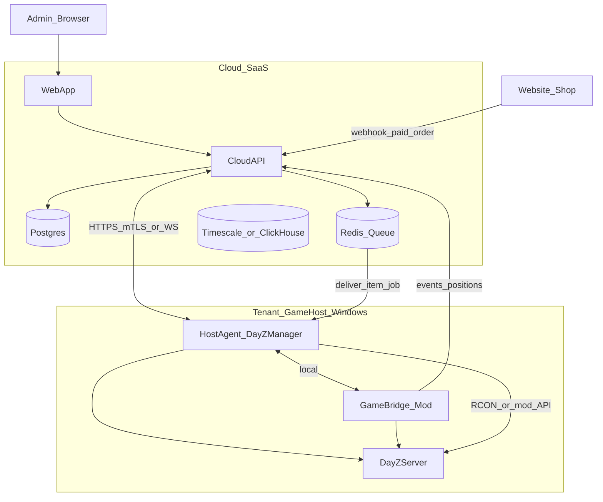

# Продуктовая архитектура: масштабирование и SaaS

**Languages:** [English](../PRODUCT_ARCHITECTURE.md) · [Русский](PRODUCT_ARCHITECTURE.md)

Документ фиксирует целевую архитектуру, если DayZ Manager развивается от «панели на хосте» до **облачного продукта** с доступом из интернета, игровыми фичами и перепродажей другим владельцам серверов.

**Текущий код** (`dayz_manager`) — это слой **Host Agent** (фаза 1). Облако и Game Bridge — отдельные контуры, не расширение одного EXE.

Связанные документы:

- [HOW_IT_WORKS.md](HOW_IT_WORKS.md) — как устроен agent сегодня
- [ROADMAP.md](ROADMAP.md) — ближайшие фичи UI на хосте (фаза 2)
- Донаты/магазин (бизнес-логика арендатора): вне этого репозитория

---

## Куда растёт продукт

| Зона | Примеры | Где жить |
|------|---------|----------|
| **A. Управление хостом** | Старт/стоп DayZ, моды, рестарты, логи менеджера | **Host Agent** (текущий `dayz_manager`) |
| **B. Игровая логика** | Выдача предметов, позиции на карте, онлайн | **Game Bridge** (мод / Expansion / COT / свой скрипт) |
| **C. Облако** | Логин админов, мультисервер, карта, статистика, биллинг | **Cloud API + Web App** |
| **D. Интеграции** | Оплата, сайт, Discord | **Shop / Payment service** |

---

## Целевая схема (три уровня)

---

## Почему не расширять один EXE до «всего в интернете»

1. **Доступ из интернета** — нельзя публиковать `0.0.0.0:8000` с одним `X-API-Key`. Нужны HTTPS, OAuth/2FA, RBAC, rate limit, audit, изоляция арендаторов (tenant).
2. **Карта и игроки в реальном времени** — RCON и логов недостаточно. Нужен **Game Bridge**, который шлёт координаты и события.
3. **Магазин и автовыдача** — очередь заказов, идемпотентность, подтверждение выдачи. Иначе дубли предметов и споры.
4. **Продажа другим владельцам** — multi-tenant SaaS: аккаунт, N серверов, тарифы, биллинг. Один `config.json` на диске не масштабируется.

Текущий стек (Python monolith + PyInstaller) **оставить для Agent**; публичную админку и магазин — в Cloud.

---

## Компоненты

### 1. Host Agent (эволюция `dayz_manager`)

- Windows, рядом с dedicated server.
- Процессы, моды, локальный RCON, выполнение **jobs из облака** (выдача, кик, рестарт).
- Связь с облаком: **исходящий** WebSocket или mTLS (agent подключается сам — не открывать порты на хосте клиента).
- Не публиковать панель в интернет; не хранить секреты платёжки в открытом виде.

### 2. Game Bridge (новый слой)

Зависит от модпака:

- Expansion / Community Online Tools / VPP — часть функций через их API/RCON.
- **Свой server mod** — полный контроль (позиции, машины, callback при выдаче).

Bridge принимает команды от Agent и пушит события: `player_position`, `vehicle_position`, `connect`/`disconnect`, `death`, и т.д.

### 3. Cloud (ядро продукта для продажи)

| Компонент | Пример стека | Назначение |
|-----------|--------------|------------|
| API | Go / .NET / FastAPI (отдельный сервис) | tenants, auth, jobs, billing |
| DB | PostgreSQL | пользователи, серверы, заказы, роли |
| Очередь | Redis / NATS | выдача предметов, ретраи |
| Статистика | TimescaleDB / ClickHouse | киллы, онлайн, экономика |
| Карта (live) | Redis + WebSocket fanout | последние позиции |
| Web | React/Next или Vue | админка + публичная статистика |
| Файлы | S3-совместимое | бэкапы, экспорт |

Публичный сайт для игроков и админка могут быть одним фронтом с разными ролями.

### 4. Магазин

Типовой поток:

1. Игрок платит на сайте (Stripe, ЮKassa, …).
2. Webhook → Cloud: `order_paid` (подпись, idempotency key).
3. Cloud создаёт `delivery_job`: `server_id` + `steam_id` + `product_sku`.
4. Agent/Bridge на хосте выполняет выдачу.
5. Callback `delivered` / `failed` → статус на сайте.

Бизнес-правила донатов/магазина: в Cloud, не в EXE

---

## Безопасность (минимум для продажи)

- Cloud только по **HTTPS** (Let's Encrypt / Cloudflare).
- **Tenant isolation**: `owner_id` на всех сущностях; token agent привязан к tenant.
- **RBAC**: owner / admin / moderator / viewer; отдельные права на выдачу, карту, финансы.
- **2FA** для владельцев.
- Agent: **без входящих портов** с интернета; rotate token.
- **Audit log**: кто выдал предмет, кто сделал рестарт.
- Rate limits и защита webhook магазина.

Текущие `X-API-Key` + `CORS *` для публичного SaaS **не подходят**.

---

## Модели продажи

| Модель | Что продаётся | Инфра |
|--------|---------------|--------|
| **Self-hosted license** | Agent + Bridge + опционально Cloud у клиента | Лицензия, обновления |
| **SaaS** | Подписка за сервер/слот | Ваш Cloud; у клиента только Agent+Bridge |
| **Hybrid** | SaaS-панель + agent на железе клиента | Частый вариант для DayZ |

Для SaaS: онбординг (token → agent → сервер в панели), health dashboard, версии API agent/cloud.

---

## Оценка текущего стека (кратко)

**Удачно для Agent:** Python, FastAPI, asyncio scheduler, subprocess/psutil, static web, PyInstaller, модульное разделение (`server_mgr`, `mod_sync`, `scheduler`).

**Долг перед масштабом:**

- Синхронные `prepare_server_for_start` / `start_server` в async routes блокируют event loop — вынести в `run_in_executor`.
- PyInstaller тянет лишние модули из глобального Python — отдельный venv и жёсткий `.spec`.
- Нет multi-tenant, нет исходящего канала в Cloud.

**Менять язык целиком не обязательно** — эволюция Agent + новый Cloud + Bridge.

---

## Практичный roadmap

| Фаза | Содержание |
|------|------------|
| **1 (сделано)** | Стабильный Host Agent на хосте |
| **1.5** | Executor в API; заглушка исходящего канала в Cloud; remote jobs |
| **2** | Cloud MVP: auth, привязка agent, базовая выдача через RCON/известный mod |
| **3** | Карта (Bridge + WebSocket), статистика (логи → mod events) |
| **4** | Магазин, биллинг, white-label |

Текущий UI в этом репо — **локальная панель на хосте / будущая agent-поверхность**. Публичная админка остаётся отдельным frontend на Cloud API.

---

## Рекомендации по стеку по слоям

| Слой | Рекомендация |
|------|----------------|
| Host Agent | **Python** — оставить |
| Game Bridge | Enforce / mod + локальный relay при необходимости |
| Cloud API | Go / .NET для нагрузки; **FastAPI** для быстрого MVP одной командой |
| Frontend | **React/Next** — карта (Leaflet/Mapbox), дашборды, i18n |
| Realtime | WebSocket через **Cloud**, не через agent в интернет |

---

## Риски DayZ-специфики

- Разные модпаки у клиентов — нужны **адаптеры** (`ExpansionAdapter`, `COTAdapter`, `VanillaRCONAdapter`) или «официальный» mod для SaaS.
- Steam/Workshop — только на agent; пароли не в облако.
- Продажа продукта: лицензия, SLA, GDPR при EU-игроках, политика хранения Steam ID.

---

## Итог

**Текущая архитектура оптимальна для управления хостом.** Для интернета, карты, статистики, магазина и перепродажи нужна система **Cloud + Host Agent + Game Bridge**. Monolith EXE с UI на `:8000` в интернет не масштабируется и небезопасен как единственная точка продукта.

---

*Документ создан: 2026-05-23. Контекст: обсуждение масштабирования после merge `feature/stability` → `main`.*
